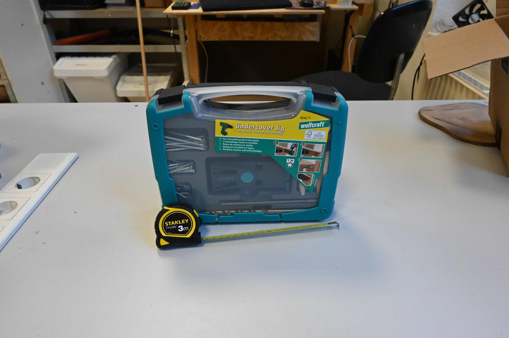

# 1. Zuwendungsempfänger
#### Bezeichnung des Antragstellers
Makerspace Gütersloh e.V.

#### Anrede
Verein

#### Titel

#### Vorname / Name 1
Makerspace Gütersloh e.V.

#### Nachname / Name 2
c/o Die WEBEREI – Bürgerkiez gGmbH

#### Straße / Nr.
Bogenstraße 1-8

### PLZ
33330

#### Ort
Gütersloh

#### Postfach

#### PLZ Postfach

#### Ort Postfach

#### Telefon
05241-2249910

#### Fax

#### E-Mail
info@makerspace-gt.de

#### DE-Mail

#### IBAN
DE52 4786 0125 1226 2315 00

# 2. Vertretungsberechtigter
#### Anrede
Herr

#### Titel

#### Vorname / Name 1
Michael

#### Nachname / Name 2
Prange

#### Organ / Vertretungsart
Vorstand

#### Straße / Nr.
Bogenstraße 1-8

### PLZ
33330

#### Ort
Gütersloh

#### Telefon
05241-2249910

#### Fax

#### E-Mail
michael@makerspace-gt.de

#### DE-Mail

# 3. Maßnahmenangaben
#### Betreff
Verwendungsnachweis zur Maßnahme Einrichtung einer Möbelwerkstatt - rni-future

#### Position
1.1 Heimat-Scheck

#### Bewilligung vom
08.09.2021

#### AZ
35.12.01.001/2021-GT-013

#### Über
2.000,00 €

#### Insgesamt bewilligt
2.000,00 €

#### Es wurden ausgezahlt insges.
2.000,00 €

# 4. Sachbericht

1. Die durchgeführte Maßnahme ist unter anderem mit Beginn, Dauer, Abschluss, Erfolg und Auswirkungen der Maßnahme kurz darzustellen. Gegebenenfalls können auch Videos, Fotos oder ähnliche Darstellungen beigefügt oder auf deren Fundstelle hingewiesen werden.
2. Bestätigung, dass die Maßnahmen entsprechend dem Zuwendungsantrag und dem Zuwendungsbescheid durchgeführt worden sind, und zwar in Bezug auf die zu Grunde liegenden Planungen, die Qualität und die Standards. Wesentliche Abweichungen sind im Detail in vergleichender Darstellung (Antrag sowie tatsächliche Ausführung) zu beschreiben.
3. Bestätigung, dass zuwendungsfähige Ausgaben mindestens in Höhe des Finanzierungsplanes des Zuwendungsantrags und des Zuwendungsbescheids entstanden sind.

#### Sachbericht

Als wir im September erfahren haben, dass unsere Förderung bewilligt wird, wurde zunächst die Einkaufsliste noch einmal geprüft. Anschließend wurden die Hersteller und Lieferanten bzgl. einer Rabattanfrage kontaktiert. Aufgrund der allgemein schlechten wirtschaftlichen Situation durch Corona war es für viele Unternehmen nicht möglich einen Rabatt anzubieten. Trotzdem haben wir in drei Fällen einen Nachlass bekommen und die Mess- & Anreißmittel wurden sogar gänzlich gespendet.  
Im Oktober wurden dann die meisten Einkäufe erledigt, wenn aufgefallen ist, dass noch etwas fehlt, wie beispielsweise Fräser, Leim oder Schraubzwingen, wurde die Einkaufsliste kurzerhand angepasst. Es sollte sich nicht akribisch an den Plan gehalten werden, sondern das Ziel - eine Möbelwerkstatt einzurichten - erreicht werden. Insgesamt haben wir 2.499,11 € von ursprünglich geplanten 2.426,05 € ausgegeben.  
Wenn eine Maschine geliefert wurde, haben wir einen Lagerplatz eingerichtet, einen kurzen Funktionstest durchgeführt, um uns von der Qualität zu überzeugen und einen Adapter für das osVAC Absaugsystem (https://ossso.de/osvac/) mit dem 3D-Drucker hergestellt.

Obwohl das Vereinsleben aktuell noch eingeschränkt ist konnten wir trotzdem schon einige Projekte umsetzen. Für unsere Werkstatt haben wir ein neues Gestell für die Werkbank gebaut und ein Regal, welches auch als Stehtisch genutzt wird. Die Materialien dafür waren alte Deckenbalken bzw. ein Kleiderschrank. Eines unserer Mitglieder hat einen Esstisch mit Sitzbank gebaut und es wurden verschiedene Weihnachtsgeschenke hergestellt: ein Bilderrahmen, ein Regal für eine Toniebox, Weihnachtssterne und ein Balanceboard.

Es wurden noch nicht alle Projekte die geplant sind umgesetzt. So muss noch die Vorderzange und die zentrale Absaugung gebaut werden. Das Material dafür ist schon vorhanden und es müssen sich nun nur noch Termine unter den Personen ergeben, die gerne daran mitarbeiten möchten.  
Bei einigen der Projekte wurde eine geliehene Domino Fräse von Festool eingesetzt. Das ist ein Werkzeug, welches sehr praktisch, aber leider auch sehr teuer ist. Trotzdem würden wir dies in Zukunft auch gerne zu unserer Ausstattung zählen und sind uns sicher, dass wir das auch erreichen können.

Die Unterlagen zu dieser Förderung sind auf github (https://github.com/makerspace-gt/rni-future-fund) dokumentiert, sodass auch andere Initiativen davon profitieren können.

# 5. Zahlenmäßiger Nachweis
|  Nr.  | Leistendes Unternehmen           | Art der Leistung                                     | Zahldatum  |  Betrag in EUR | Link                                                                                                                                                                                                            |
| :---: | :------------------------------- | :--------------------------------------------------- | :--------: | -------------: | --------------------------------------------------------------------------------------------------------------------------------------------------------------------------------------------------------------- |
|       |                                  | **Infrastruktur**                                    |            |                |                                                                                                                                                                                                                 |
|   1   | Eigenbau                         | Werkbank                                             | 30.11.2021 |         0,00 € |                                                                                                                                                                                                                 |
|   2   | Dieter Schmid Werkzeuge          | Vorderzangenführung                                  | 03.11.2021 |        74,20 € | https://www.feinewerkzeuge.de/spindel.html                                                                                                                                                                      |
|   3   | Hornbach                         | Buchen-Leimholzplatte                                | 04.11.2021 |        67,00 € | https://www.hornbach.de/shop/Leimholzplatte-Buche-B-C-2500x400x27-mm/5065362/artikel.html                                                                                                                       |
|   4   | Amazon                           | as - Schwabe Hängeverteiler Zugspitze                | 05.10.2021 |        35,61 € | https://www.amazon.de/dp/B007J41YUK                                                                                                                                                                             |
|   5   | Dichtstofftechnik Müller & Mülle | Soudal Holzleim Pro 30 D, 750g                       | 04.11.2021 |        14,19 € | https://www.amazon.de/gp/product/B006PHUOK8                                                                                                                                                                     |
|       |                                  | **Absaugung**                                        |            |                |                                                                                                                                                                                                                 |
|   6   | Alternate                        | Kärcher Nass-/Trockensauger NT 30/1 TACT L           | 13.10.2021 |       354,82 € | https://www.alternate.de/K%C3%A4rcher/Nass-Trockensauger-NT-30-1-TACT-L/html/product/1350312                                                                                                                    |
|   7   | Schoppengerdt                    | Zyklon Staubabscheider, 30 L                         | 08.10.2021 |        68,90 € | https://www.ebay.de/itm/263546147596                                                                                                                                                                            |
|   8   | agdmaster                        | Staubsaugerschlauch, DN32, 15 m                      | 05.10.2021 |        36,99 € | https://www.amazon.de/dp/B081QK7L46                                                                                                                                                                             |
|   9   | FormFutura                       | Filament                                             | 13.10.2021 |        48,79 € |                                                                                                                                                                                                                 |
|       |                                  | **Elektro-Handwerkzeuge**                            |            |                |                                                                                                                                                                                                                 |
|  10   | Alango                           | Makita Oberfräse RT0700CX2J                          | 05.10.2021 |       170,00 € | https://www.alango.de/alle-kategorien/fraesen/kabelgebundene-geraete/218/makita-rt0700cx2j-einhandfraese                                                                                                        |
|  11   | Amazon                           | Bosch Rand- und Kantenfräser Set                     | 05.12.2021 |        26,50 € | https://www.amazon.de/gp/product/B07M6QNWS2                                                                                                                                                                     |
|  12   | Schwemmer & Dorn                 | Metabo Bandsäge BAS 261                              | 05.10.2021 |       258,04 € | https://www.kaufland.de/product/313804729/                                                                                                                                                                      |
|  13   | OnlineDeal24                     | Metabo Kapp-/Gehrungssäge KGS 254 M                  | 05.10.2021 |       246,50 € | https://www.onlinedeal24.de/details/metabo-kgs-254-m-kapp-und-gehrungssaege-mit-zugfunktion-602540000                                                                                                           |
|  14   | Zahrt Handels-GmbH               | Bosch Akku-Bohrschrauber GSR 12V-35                  | 13.10.2021 |       214,62 € | https://werkzeugstore24.de/bosch-akku-bohrschrauber-gsr-12v-35-fc-flexiclick-12-v-2x-3-0-ah-akku-ladegeraet-inkl-4-aufsaetzen-in-l-boxx-06019h3000.html                                                         |
|  15   | Zahrt Handels-GmbH               | Bosch Akku-Multi-Cutter GOP 12V-28                   | 13.10.2021 |        78,17 € | https://werkzeugstore24.de/bosch-akku-multi-cutter-gop-12v-28-professional-12-v-solo-im-karton-06018b5001.html                                                                                                  |
|  16   | Zahrt Handels-GmbH               | Bosch Akku-Stichsäge GST 12V-70                      | 13.10.2021 |        65,33 € | https://werkzeugstore24.de/bosch-akku-stichsaege-gst-12v-70-solo-inkl-zubehoer-set-06015a1001.html                                                                                                              |
|  17   | Vereinsmitglied                  | Dauerleihgabe: Makita Akku-Winkelschleifer           | 01.10.2021 |         0,00 € |                                                                                                                                                                                                                 |
|  18   | Vereinsmitglied                  | Dauerleihgabe: Makita Akku-Exzenterschleifer DBO180Z | 01.10.2021 |         0,00 € | https://www.makita.de/product/dbo180z.html                                                                                                                                                                      |
|  19   | tewipack                         | 3M Xtract Cubitron II Schleifscheibe 710W Set        | 05.12.2021 |        23,21 € | https://shop.tewipack.de/schleifen-und-polieren/schleifmittel/hookit-kletthaftende-schleifprodukte/3m-xtract-cubitron-ii-schleifscheibe-710w-set-15710w125set                                                   |
|  20   | Vereinsmitglied                  | Dauerleihgabe: Makita Akku-Schlagschrauber DTD155    | 01.10.2021 |         0,00 € | https://www.makita.ch/produkt/dtd155.html                                                                                                                                                                       |
|  21   | Vereinsmitglied                  | Dauerleihgabe: Makita Akku-Staubsauger DCL281FZ      | 01.10.2021 |         0,00 € | https://www.makita.de/product/dcl281fz.html                                                                                                                                                                     |
|  22   | Zahrt Handels-GmbH               | Makita Schnellladegerät DC18RC                       | 13.10.2021 |        32,66 € | https://werkzeugstore24.de/makita-dc18rc-schnellladegeraet-18-volt-195584-2.html                                                                                                                                |
|       |                                  | **Stationäre Werkzeuge**                             |            |                |                                                                                                                                                                                                                 |
|  23   | toom                             | Scheppach Tischbohrmaschine DP18 Vario               | 12.10.2021 |       259,99 € | https://toom.de/p/tischbohrmaschine-dp18-vario/1501629                                                                                                                                                          |
|  24   | Sorotec                          | Stufenspannpratzen-Set                               | 11.10.2021 |        36,99 € |                                                                                                                                                                                                                 |
|  25   | Sorotec                          | Fräser                                               | 11.10.2021 |        88,61 € |                                                                                                                                                                                                                 |
|       |                                  | **Manuelle Handwerkzeuge**                           |            |                |                                                                                                                                                                                                                 |
|  26   | Dieter Schmid Werkzeuge          | Ryoba "Lifesaw" japanische Säge                      | 13.10.2021 |        35,45 € | https://www.feinewerkzeuge.de/ryoba.html                                                                                                                                                                        |
|  27   | Dieter Schmid Werkzeuge          | NAREX Stemmeisenset WOOD LINE PROFI                  | 13.10.2021 |        64,25 € | https://www.feinewerkzeuge.de/narex-stemmeisen.html                                                                                                                                                             |
|  28   | Vereinsmitglied                  | Spende: Nassschleifstein                             | 07.11.2021 |         0,00 € |                                                                                                                                                                                                                 |
|  29   | Vereinsmitglied                  | Spende: Möbel-Tacker                                 | 07.11.2021 |         0,00 € |                                                                                                                                                                                                                 |
|  30   | Amazon                           | Bosch Klammern Typ 53 x 14 mm                        | 06.12.2021 |         5,29 € | https://www.amazon.de/gp/product/B002WRICD6                                                                                                                                                                     |
|  31   | Vereinsmitglied                  | Spende: wolfcraft Meisterdübler                      | 08.09.2021 |         0,00 € | https://www.amazon.de/dp/B0001P19PY                                                                                                                                                                             |
|  32   | Amazon                           | wolfcraft Undercover Jig-Set                         | 05.10.2021 |        38,45 € | https://www.amazon.de/gp/product/B07CT2XTVG                                                                                                                                                                     |
|  33   | Messwelt                         | Spende: Anschlagwinkel, 300 x 175                    | 27.09.2021 |         0,00 € | https://www.messwelt.com/produkte/winkel-praezision/kontrollwinkel-din-875-normalstahl-mit-anschlag/kontrollwinkel-normalstahl-din-8752-mit-anschlag/11831/kontrollwinkel-300-x-175-mm-mit-anschlag-normalstahl |
|  34   | Messwelt                         | Spende: Streichmaß, 250 mm                           | 27.09.2021 |         0,00 € | https://www.messwelt.com/produkte/anreisswerkzeuge/streichmasse-aus-aluminium/9495/streichmass-250-mm-aluminium                                                                                                 |
|  35   | Messwelt                         | Spende: Universal-Winkelmesser, 300 mm               | 27.09.2021 |         0,00 € | https://www.messwelt.com/produkte/winkel-gradmesser/universal-winkelmesser-mit-lupe-und-feineinstellung/13651/universal-winkelmesser-mit-lupe-schiene-300-mm                                                    |
|  36   | Amazon                           | Stanley Bandmass, 3 m                                | 05.10.2021 |         2,84 € | https://www.amazon.de/dp/B0024QQQME                                                                                                                                                                             |
|  37   | Gravonoh                         | MOHOO Kegelsenker ø 6,3-20,5                         | 27.10.2021 |        22,99 € | https://www.amazon.de/gp/product/B07H3XKSND                                                                                                                                                                     |
|  38   | Contorion                        | STIER Korpuszwingen, 1200 mm, 6000 N                 | 30.11.2021 |       128,72 € | https://www.amazon.de/dp/B08KVVYQW8                                                                                                                                                                             |
|       |                                  | **Summe**                                            |            | **2.499,11 €** |

|                                                                |            |
| -------------------------------------------------------------: | ---------: |
|                                             Summe Gesamtkosten | 2.499,11 € |
|                        abzgl. Einnahmen und Leistungen dritter |     0,00 € |
|                                Zuwendungsfähige Gesamtausgaben | 2.499,11 € |
|                                                   Förderbetrag | 2.000,00 € |
| verbleibender Eigenanteil (oder gegebenenfalls Rückzahlbetrag) |   499,11 € |

#### Ist die Ausgabesumme niedriger als der Förderbetrag, so sind die Gründe der Ausgabenveränderung darzustellen. Der Differenzbetrag ist zudem umgehend zurückzuzahlen.

# 6. Bestätigungen
Es wird bestätigt, dass...

- [x] die Allgemeinen und Besonderen Nebenbestimmungen des Zuwendungsbescheides beachtet wurden,
- [x] die Ausgaben notwendig waren, wirtschaftlich und sparsam verfahren worden ist und die Angaben im Verwendungsnachweis mit den Büchern und Belegen übereinstimmen,
- [x] für die Durchführung der Maßnahme keine weitere Förderung von Dritten gewährt wurde oder noch gewährt wird,
- [x] die Originalbelege für die Dauer von fünf Kalenderjahren nach Vorlage dieses Verwendungsnachweises für Prüfzwecke vorgehalten werden und

die Antragstellerin oder der Antragsteller zum Vorsteuerabzug:

- [x] nicht berechtigt beziehungsweise
- [ ] berechtigt ist und dies bei der Berechnung der Ausgaben berücksichtigt hat.

# 7. Dokumentenupload
Es können noch 2 Dokument(e) hochgeladen werden.

| Bezeichnung             | Name                                                                            |                                                                                  |
| :---------------------- | :------------------------------------------------------------------------------ | -------------------------------------------------------------------------------- |
| alte Werkbank           | [5765cfab46367a100474a019de7f82d8](images/5765cfab46367a100474a019de7f82d8.jpg) |  |
| Werkbank iso            | [2539a4913dc1e5600ff21527093d4eb2](images/2539a4913dc1e5600ff21527093d4eb2.jpg) |  |
| Werkbank vorne          | [fe4fdc2ba5b7781fe597bdc8fdb16eb4](images/fe4fdc2ba5b7781fe597bdc8fdb16eb4.jpg) |  |
| Material Regal          | [98061fcb963c740420421047f17e6a6e](images/98061fcb963c740420421047f17e6a6e.jpg) |  |
| Regal                   | [aa0974030dd46483955966191aaac130](images/aa0974030dd46483955966191aaac130.jpg) |  |
| Weihnachtssterne        | [cb36f0f8367aada802b623fd731c2a2e](images/cb36f0f8367aada802b623fd731c2a2e.jpg) |  |
| Material Vorderzange    | [3298dc54d1127aba416f078b1766d629](images/3298dc54d1127aba416f078b1766d629.jpg) |  |
| Steckdosenwürfel        | [07479b01faa18758e0aa7beec53ba327](images/07479b01faa18758e0aa7beec53ba327.jpg) |  |
| Staubsauger             | [7e4c639c8d87492b8c28a80a8dc0f28e](images/7e4c639c8d87492b8c28a80a8dc0f28e.jpg) |  |
| Zyklonabscheider        | [fed303aba002becba8ff21cef36a17ad](images/fed303aba002becba8ff21cef36a17ad.jpg) |  |
| Staubsaugerschlauch     | [d0e7279ca66c33581edba8dfe037e659](images/d0e7279ca66c33581edba8dfe037e659.jpg) |  |
| Oberfräse               | [ff60641aeb6cf7335cf73de4e358bf6f](images/ff60641aeb6cf7335cf73de4e358bf6f.jpg) |  |
| Bandsäge                | [bc93d7a60d0058b46d8a49e445ca672e](images/bc93d7a60d0058b46d8a49e445ca672e.jpg) |  |
| Bandsäge                | [cf4085d51adcc0ed71fbc87f9e9c09cf](images/cf4085d51adcc0ed71fbc87f9e9c09cf.jpg) |  |
| Kapp- und Gehrungssäge  | [b304b3eb85d51e41009e033046776037](images/b304b3eb85d51e41009e033046776037.jpg) |  |
| Bosch Geräte            | [262e0bb94abf3cecd11b601c80171d17](images/262e0bb94abf3cecd11b601c80171d17.jpg) |  |
| "Makita" Geräte         | [ba2b2453982f02a2a3ce0ff38423282f](images/ba2b2453982f02a2a3ce0ff38423282f.jpg) |  |
| Makita Ladegerät        | [f8f243b2a16f2e614631e57daeed569d](images/f8f243b2a16f2e614631e57daeed569d.jpg) |  |
| Tischbohrmaschine       | [c00df15a73dda0f51aecd72387ddadf2](images/c00df15a73dda0f51aecd72387ddadf2.jpg) |  |
| Fräser                  | [6b447c52e92e42981b28f6e8e36c1171](images/6b447c52e92e42981b28f6e8e36c1171.jpg) |  |
| Japansäge & Stechbeitel | [cb4709dc6f850f2b9e1278c8722d3941](images/cb4709dc6f850f2b9e1278c8722d3941.jpg) |  |
| Nassschleifstein        | [59ca63b24808b0eec57735a611ad8637](images/59ca63b24808b0eec57735a611ad8637.jpg) |  |
| Möbeltacker             | [fd1014ee40cdc07cf368593fe822c634](images/fd1014ee40cdc07cf368593fe822c634.jpg) |  |
| Maßband & Dübelhilfe    | [e625278728a43bb793614df5e5a59b5b](images/e625278728a43bb793614df5e5a59b5b.jpg) |  |
| Mess- und Anreißmittel  | [9baa8107127b7ea67372f1f1b48fc8f4](images/9baa8107127b7ea67372f1f1b48fc8f4.jpg) |  |
| Bleistifte              | [8c5d986c8b4055a888c9d981a0a754a3](images/8c5d986c8b4055a888c9d981a0a754a3.jpg) |  |
